### 1. 工业相机选型的三个最核心参数是什么？它们的计算公式或选择逻辑是怎样的？

#### 1.1 什么是工业相机选型，为什么需要关注核心参数？
工业相机选型是指根据特定的机器视觉应用需求，从众多技术规格中选择最合适的工业相机型号的过程。这需要考虑成像质量、系统性能、成本效益等多个维度。关注核心参数是因为工业相机性能直接决定了整个视觉系统的精度、速度和可靠性，错误的选型可能导致项目失败或成本浪费。

#### 1.2 第一个核心参数：分辨率（Resolution）的选择逻辑是什么？
分辨率是工业相机最重要的参数之一，它决定了相机能够捕捉的图像细节程度。分辨率的选择逻辑基于以下几个关键因素：

**选择逻辑：**
1.  **视场（FOV）与精度要求**：首先确定需要检测的物体大小（视场），然后根据检测精度要求计算所需的最小像素数。
2.  **亚像素精度**：对于高精度测量应用，通常需要3-5倍的亚像素精度，这意味着实际需要的像素数比理论最小值要高。
3.  **相机传感器尺寸**：分辨率与传感器尺寸共同决定了像素尺寸，进而影响成像质量和景深。

**计算公式：**
$$
\text{所需分辨率} = \frac{\text{视场尺寸}}{\text{检测精度}} \times \text{亚像素系数}
$$

例如，如果要检测一个100mm宽的物体，需要达到0.1mm的检测精度，并采用3倍亚像素精度，则所需分辨率为：
$$
\text{分辨率} = \frac{100\text{mm}}{0.1\text{mm}} \times 3 = 1000 \times 3 = 3000\text{像素}
$$
这意味着至少需要3000像素的横向分辨率。

#### 1.3 第二个核心参数：帧率（Frame Rate）的计算公式是什么？
帧率决定了相机每秒能够采集的图像数量，直接影响系统的检测速度。

**选择逻辑：**
1.  **生产线速度**：根据生产线的移动速度确定最小帧率要求。
2.  **曝光时间约束**：高速运动物体需要短曝光时间，这会限制有效帧率。
3.  **处理能力匹配**：相机的帧率必须与图像处理系统的处理能力相匹配。

**计算公式：**
$$
\text{所需帧率} = \frac{\text{生产线速度}}{\text{检测区域长度}} \times \text{安全系数}
$$

更精确的计算需要考虑物体运动模糊：
$$
\text{最大允许曝光时间} = \frac{\text{允许的像素移动量}}{\text{物体运动速度}}
$$

例如，生产线速度为1m/s，检测区域长度为50mm，需要至少2倍重叠采样，则：
$$
\text{帧率} = \frac{1000\text{mm/s}}{50\text{mm}} \times 2 = 20 \times 2 = 40\text{fps}
$$

#### 1.4 第三个核心参数：像元尺寸（Pixel Size）如何影响成像质量？
像元尺寸是每个感光单元的物理尺寸，它直接影响相机的灵敏度、动态范围和信噪比。

**选择逻辑：**
1.  **灵敏度要求**：较大的像元尺寸能够收集更多光子，提高低光照条件下的灵敏度。
2.  **动态范围**：像元尺寸越大，满阱容量通常越大，动态范围越宽。
3.  **分辨率与传感器尺寸平衡**：在固定传感器尺寸下，像元尺寸与分辨率成反比，需要在两者间取得平衡。

**影响关系：**
- **灵敏度**：$\text{灵敏度} \propto \text{像元面积}$
- **动态范围**：$\text{动态范围} \propto \log(\text{满阱容量})$
- **空间分辨率**：$\text{空间分辨率} \propto \frac{1}{\text{像元尺寸}}$

#### 1.5 这三个参数之间如何相互制约和平衡？
分辨率、帧率和像元尺寸之间存在内在的制约关系，需要综合考虑：

**制约关系示意图：**
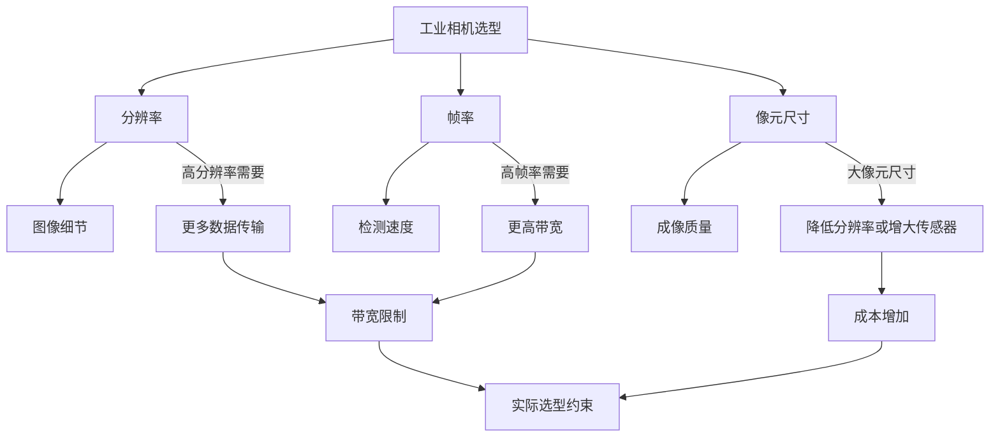

**平衡策略：**
1.  **分辨率与帧率的平衡**：高分辨率会降低最大帧率，因为需要传输更多数据。需要根据实际检测需求确定优先级。
2.  **像元尺寸与分辨率的平衡**：在固定传感器尺寸下，增大像元尺寸会降低分辨率，反之亦然。
3.  **系统级优化**：通过选择合适的接口（如GigE、USB3、CoaXPress）、优化照明和镜头系统来弥补相机参数的不足。

#### 1.6 实际选型中还需要考虑哪些辅助参数？
除了三个核心参数外，实际选型还需要考虑：

1.  **传感器类型**：CMOS vs CCD，全局快门 vs 卷帘快门
2.  **接口类型**：GigE Vision、USB3 Vision、Camera Link、CoaXPress
3.  **光谱响应**：黑白、彩色、近红外、紫外等
4.  **环境适应性**：工作温度、防护等级、抗振动能力
5.  **软件兼容性**：与视觉处理软件的兼容性和SDK支持

#### 1.7 如何通过实际案例理解这些参数的选择？
以汽车零部件尺寸检测为例：
- **视场**：200mm × 150mm
- **检测精度**：±0.05mm
- **生产线速度**：2m/s
- **工作环境**：车间正常照明

**计算过程：**
1. **分辨率计算**：$\frac{200\text{mm}}{0.05\text{mm}} \times 3 = 4000 \times 3 = 12000\text{像素（横向）}$
   $\frac{150\text{mm}}{0.05\text{mm}} \times 3 = 3000 \times 3 = 9000\text{像素（纵向）}$
   建议选择1200万像素（4000×3000）相机

2. **帧率计算**：$\frac{2000\text{mm/s}}{200\text{mm}} \times 2 = 10 \times 2 = 20\text{fps}$
   考虑处理余量，选择30fps相机

3. **像元尺寸选择**：车间照明条件良好，选择中等像元尺寸（如3.45μm）平衡灵敏度和分辨率

#### 1.8 现代工业相机技术发展趋势对参数选择有何影响？
随着技术进步，工业相机选型需要考虑以下趋势：

1.  **高分辨率趋势**：从传统的500万像素向2000万、4500万甚至1亿像素发展
2.  **高速化需求**：工业4.0推动下，对高帧率相机的需求增加，1000fps以上成为常态
3.  **智能相机兴起**：内置处理功能的智能相机减少了对传输带宽的依赖
4.  **多光谱成像**：超越传统RGB，向多光谱、高光谱发展
5.  **3D成像技术**：结构光、TOF、双目视觉等3D成像技术对相机参数有特殊要求

 标准答案：

**【核心参数总结】**
工业相机选型的三个最核心参数是**分辨率**、**帧率**和**像元尺寸**。这三个参数共同决定了视觉系统的检测能力、速度和成像质量。

**1. 分辨率（Resolution）**
分辨率是相机传感器上的像素数量，通常用横向×纵向像素数表示（如1920×1080）。选择逻辑基于视场尺寸和检测精度要求，计算公式为：
$$
\text{所需最小分辨率} = \frac{\text{视场尺寸}}{\text{检测精度}} \times \text{亚像素系数（通常2-5）}
$$
高分辨率提供更精细的图像细节，但会增加数据传输负担和处理时间。

**2. 帧率（Frame Rate）**
帧率是相机每秒采集图像的次数，单位fps。选择逻辑基于生产线速度和检测频率，计算公式为：
$$
\text{所需最小帧率} = \frac{\text{物体运动速度}}{\text{单次检测覆盖长度}} \times \text{重叠系数（通常1.5-3）}
$$
高帧率适用于高速运动物体的捕捉，但受限于接口带宽和传感器读出速度。

**3. 像元尺寸（Pixel Size）**
像元尺寸是每个感光单元的物理尺寸，单位μm。选择逻辑基于光照条件和动态范围需求：
- **大像元尺寸**（如5.86μm）：高灵敏度、宽动态范围，适合低光照条件
- **小像元尺寸**（如1.67μm）：高空间分辨率，适合细节丰富的场景

像元尺寸与分辨率的乘积决定了传感器尺寸，三者关系为：
$$
\text{传感器尺寸} = \text{分辨率} \times \text{像元尺寸}
$$

**【参数间的制约关系】**
这三个参数存在内在的相互制约：
- 在固定传感器尺寸下，**提高分辨率**必须减小像元尺寸，这会降低灵敏度和动态范围
- **提高帧率**需要更快的传感器读出和更高的接口带宽，可能限制最大分辨率
- **增大像元尺寸**提高灵敏度，但要么降低分辨率，要么增大传感器尺寸（增加成本）

**【选型流程建议】**
实际选型应遵循系统化流程：
1. 明确应用需求：检测对象、精度要求、速度要求、工作环境
2. 计算理论参数：根据公式计算最小分辨率、帧率要求
3. 考虑实际约束：接口带宽、处理能力、成本预算
4. 平衡参数选择：在相互制约的参数间找到最优平衡点
5. 验证系统兼容性：确保相机与镜头、照明、处理软件的兼容性

**【技术发展趋势】**
现代工业相机正向更高分辨率（亿级像素）、更高帧率（数千fps）、更小像元尺寸（亚微米级）和智能化方向发展。同时，全局快门CMOS传感器逐渐成为主流，提供更好的运动物体成像质量。3D视觉、多光谱成像等新兴应用也对相机参数提出了新的要求。

在实际选型中，除了这三个核心参数，还需要综合考虑传感器类型（CMOS/CCD）、接口标准（GigE/USB3/Camera Link）、光谱响应特性、环境适应性等因素，确保选择的相机能够满足特定应用场景的全面需求。

### 2.如何根据最小检测缺陷尺寸和视野范围，计算所需相机的最低分辨率？（请给出公式和例子）

#### 2.1 什么是机器视觉中的最小检测缺陷尺寸？
在机器视觉检测系统中，最小检测缺陷尺寸指的是系统能够可靠识别和测量的最小缺陷特征大小。这个参数通常由应用需求决定，比如在电子元件检测中可能是0.1mm的引脚缺陷，在PCB板检测中可能是0.05mm的焊点缺陷。这个尺寸直接决定了系统的检测精度要求。

#### 2.2 视野范围（FOV）在分辨率计算中起什么作用？
视野范围（Field of View）是指相机一次能够拍摄到的目标区域的实际物理尺寸。它通常以宽度（X方向）和高度（Y方向）两个维度表示。视野范围决定了每个像素对应的实际物理尺寸，是计算相机分辨率的基础参数之一。视野范围越大，为了保持相同的检测精度，就需要越高的分辨率。

#### 2.3 为什么需要精度因子（安全系数）？
精度因子（通常取值2~3）是为了确保检测系统的可靠性而引入的安全系数。在理想情况下，一个像素对应最小缺陷尺寸就能检测到缺陷，但实际上由于图像噪声、光学畸变、算法误差等因素，需要多个像素来表征一个最小缺陷才能保证检测的可靠性。这个因子确保了即使存在各种干扰因素，系统仍然能够稳定准确地检测出最小缺陷。

#### 2.4 相机分辨率计算的核心公式是什么？
根据搜索到的信息，相机最低分辨率的计算公式为：

**水平方向分辨率公式：**
$N_x = \frac{FOV_x}{d_{min}} \times k$

**垂直方向分辨率公式：**
$N_y = \frac{FOV_y}{d_{min}} \times k$

**总像素数公式：**
$N_{total} = N_x \times N_y$

其中：
- $N_x$：水平方向所需像素数
- $N_y$：垂直方向所需像素数
- $FOV_x$：水平视野范围（mm）
- $FOV_y$：垂直视野范围（mm）
- $d_{min}$：最小检测缺陷尺寸（mm）
- $k$：精度因子（通常取2~3）

#### 2.5 像素精度与分辨率有什么关系？
像素精度是指每个像素对应的实际物理尺寸，计算公式为：
$Pixel\ Accuracy = \frac{FOV}{Resolution}$

这个参数表示系统能够分辨的最小物理尺寸。例如，如果视野为50mm，相机水平分辨率为5000像素，那么像素精度就是0.01mm/像素。像素精度必须小于或等于最小检测缺陷尺寸除以精度因子。

#### 2.6 如何通过一个实际案例来理解这个计算过程？
假设我们需要检测PCB板上的焊点缺陷，具体要求如下：
- 最小检测缺陷尺寸：$d_{min} = 0.1mm$
- 视野范围：$FOV_x = 50mm$（宽度），$FOV_y = 40mm$（高度）
- 精度因子：$k = 2.5$（中等可靠性要求）

**计算过程：**
水平方向所需像素数：$N_x = \frac{50}{0.1} \times 2.5 = 500 \times 2.5 = 1250$像素
垂直方向所需像素数：$N_y = \frac{40}{0.1} \times 2.5 = 400 \times 2.5 = 1000$像素
总像素数：$N_{total} = 1250 \times 1000 = 1,250,000$像素（约125万像素）

**像素精度验证：**
水平像素精度：$50mm / 1250 = 0.04mm/像素$
垂直像素精度：$40mm / 1000 = 0.04mm/像素$
实际最小可检测尺寸：$0.04mm \times 2.5 = 0.1mm$（满足要求）

#### 2.7 如何选择最接近的标准分辨率相机？
在实际选型中，相机分辨率通常是标准化的。对于上述案例计算出的1250×1000像素需求，我们可以选择最接近的标准分辨率相机：
- 1280×1024像素（约131万像素）的相机
- 这个分辨率略高于计算值，提供了额外的安全余量

#### 2.8 考虑实际因素时还需要注意什么？
在实际应用中，除了上述基本计算外，还需要考虑：
1. **镜头畸变**：实际视野边缘可能存在畸变，需要适当增加分辨率余量
2. **运动模糊**：如果目标在运动，需要考虑曝光时间和运动速度的影响
3. **光照条件**：光照不均匀可能影响图像质量，需要适当提高分辨率
4. **算法要求**：某些图像处理算法可能需要更高的分辨率才能稳定工作

#### 2.9 有没有更简化的快速估算方法？
对于快速估算，可以使用以下简化公式：
$Resolution \geq \frac{FOV}{d_{min}} \times 2$

这个公式假设精度因子为2，适用于大多数一般性应用。对于高精度要求，建议使用精度因子3进行计算。

**标准答案：**

**【基本原理】**
在机器视觉系统中，相机分辨率的选择直接决定了系统的检测能力。根据最小检测缺陷尺寸和视野范围计算相机最低分辨率的核心思想是：确保每个最小缺陷在图像中由足够多的像素来表示，以保证检测的可靠性和准确性。

**示意图：分辨率计算中的参数关系**
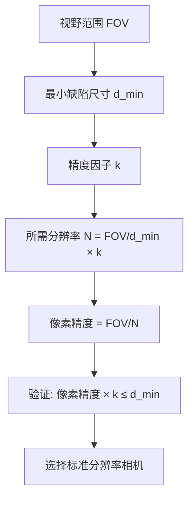

**【完整计算公式】**
**水平方向分辨率：** $N_x = \frac{FOV_x}{d_{min}} \times k$

**垂直方向分辨率：** $N_y = \frac{FOV_y}{d_{min}} \times k$

**总像素数：** $N_{total} = N_x \times N_y$

**像素精度验证：** $Pixel\ Accuracy = \frac{FOV}{N}$，需满足 $Pixel\ Accuracy \times k \leq d_{min}$

**【详细示例】**
**案例：芯片引脚缺陷检测**
- **需求参数：**
  - 最小检测缺陷尺寸：$d_{min} = 0.08mm$
  - 视野范围：$FOV_x = 60mm$，$FOV_y = 45mm$
  - 精度因子：$k = 3$（高可靠性要求）

- **计算步骤：**
  1. 水平分辨率：$N_x = \frac{60}{0.08} \times 3 = 750 \times 3 = 2250$像素
  2. 垂直分辨率：$N_y = \frac{45}{0.08} \times 3 = 562.5 \times 3 \approx 1688$像素
  3. 总像素数：$N_{total} = 2250 \times 1688 \approx 3,798,000$像素（约380万像素）
  4. 像素精度验证：
     - 水平：$60mm / 2250 = 0.0267mm/像素$
     - 垂直：$45mm / 1688 = 0.0267mm/像素$
     - 验证：$0.0267 \times 3 = 0.08mm$（满足要求）

- **相机选型建议：**
  根据计算结果，建议选择分辨率接近或略高于2250×1688的标准相机，如：
  - 2448×2048像素（约500万像素）的相机
  - 这个选择提供了约8.7%的额外余量，有助于应对实际应用中的各种不确定性因素

**【注意事项】**
1. **精度因子选择**：对于一般应用，k=2~2.5；对于高精度要求，k=3；对于极高精度要求，k=4~5。
2. **分辨率标准化**：实际相机分辨率通常是标准值（如640×480、1280×1024、1920×1080等），选择时应向上取整到最接近的标准分辨率。
3. **综合考量**：除了分辨率，还需要考虑相机的帧率、接口类型（GigE、USB3.0等）、传感器尺寸等因素。
4. **实际验证**：理论计算后，建议通过实际测试验证系统的检测能力，特别是在边缘区域和不同光照条件下的表现。

**【快速参考表】**
| 应用类型 | 典型最小缺陷尺寸 | 建议精度因子 | 备注 |
|---------|----------------|-------------|------|
| 一般外观检查 | 0.5-1.0mm | 2.0 | 对精度要求不高 |
| 电子元件检测 | 0.1-0.3mm | 2.5 | 中等精度要求 |
| PCB焊点检测 | 0.05-0.1mm | 3.0 | 高精度要求 |
| 精密零件测量 | 0.01-0.05mm | 3.5-4.0 | 极高精度要求 |

通过以上计算方法和示例，您可以根据具体的应用需求，科学地确定所需相机的最低分辨率，从而确保机器视觉检测系统的性能和可靠性。

---

### 3. 全局快门和卷帘快门的根本区别是什么？为什么动态工业检测必须用全局快门？卷帘快门在什么情况下可以使用？

#### 3.1 全局快门和卷帘快门在物理实现上的根本区别是什么？

全局快门和卷帘快门的核心区别在于**像素曝光的时间同步性**。在全局快门传感器中，所有像素在同一时刻开始曝光，并在同一时刻结束曝光，整个传感器阵列像一个"全局"的窗户同时打开和关闭。而在卷帘快门传感器中，像素是逐行顺序曝光的，从图像顶部到底部（或从左到右）像卷帘一样滚动进行曝光。

这种物理实现差异可以通过下面的示意图来理解：

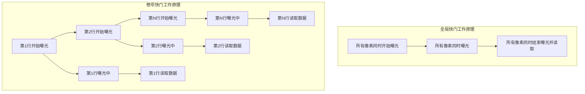

#### 3.2 这种物理差异会带来什么样的图像采集效果差异？

由于卷帘快门的逐行扫描特性，当拍摄**运动物体**或**相机本身移动**时，会产生所谓的"卷帘快门效应"。具体表现为：垂直的直线会变成斜线（如建筑物的垂直边缘变成倾斜的），快速旋转的物体（如风扇叶片）会呈现扭曲的形态，快速移动的物体会出现"果冻效应"（jello effect）。

全局快门由于所有像素同时曝光，无论物体如何运动，都能捕捉到同一时刻的完整图像，不会产生这种时间错位导致的几何畸变。这对于需要精确几何测量的工业检测应用至关重要。

#### 3.3 为什么动态工业检测必须使用全局快门？

动态工业检测场景通常涉及**高速运动的物体**（如传送带上的产品、机械臂抓取的工作、飞行的无人机部件等）。在这些场景下，使用卷帘快门会产生不可接受的图像畸变，导致检测算法无法准确识别物体特征、测量尺寸或判断缺陷位置。

具体来说，动态工业检测需要全局快门的主要原因包括：

1.  **几何精度要求**：工业检测往往需要对物体的尺寸、位置、角度进行亚像素级别的精确测量。卷帘快门效应引入的几何畸变会直接破坏测量精度，导致检测结果不可靠。

2.  **同步性需求**：许多工业检测系统需要与外部设备（如机械臂、PLC控制器、光源触发器等）精确同步。全局快门能够确保所有像素在同一时刻响应外部触发信号，实现真正的同步采集。

3.  **高速运动捕捉**：在高速生产线（如每分钟数百个产品的包装线）上，物体移动速度极快。卷帘快门逐行扫描的时间差会导致同一图像中不同部分对应不同时刻的物体位置，产生严重的运动模糊和几何失真。

4.  **振动环境适应性**：工业现场往往存在机械振动，如果相机安装在振动的设备上，卷帘快门会放大振动效应，导致图像模糊和抖动。

#### 3.4 卷帘快门在什么情况下可以接受使用？

尽管卷帘快门在动态工业检测中存在严重问题，但在某些特定场景下仍然可以接受使用：

1.  **静态场景拍摄**：当被拍摄物体完全静止，且相机也固定不动时，卷帘快门和全局快门的效果完全相同。这种情况下，卷帘快门通常成本更低、功耗更小。

2.  **缓慢运动场景**：如果物体移动速度非常缓慢（相对于曝光时间），卷帘快门效应可以忽略不计。例如，监控缓慢移动的车辆、人员走动等。

3.  **消费级应用**：手机摄像头、网络摄像头、数码相机等消费电子产品大多使用卷帘快门，因为在这些应用中，轻微的几何畸变通常可以被用户接受，而卷帘快门在成本和功耗方面具有优势。

4.  **特定视觉任务**：对于不依赖精确几何信息的任务，如人脸识别、场景分类、物体检测（不要求精确边界框）等，卷帘快门效应的影响相对较小。

5.  **成本敏感应用**：在预算有限且对图像质量要求不极端严格的情况下，卷帘快门传感器通常比全局快门传感器便宜20%-50%，是更具成本效益的选择。

#### 3.5 全局快门和卷帘快门在技术实现上的具体差异有哪些？

从技术实现层面来看，全局快门传感器需要每个像素单元都配备一个**存储电容**来临时保存曝光期间积累的电荷。这意味着像素结构更复杂，填充因子（有效感光面积占比）通常较低，导致感光灵敏度相对较差。而卷帘快门传感器结构更简单，填充因子更高，在低光条件下通常表现更好。

全局快门的另一个挑战是**暗电流噪声**。由于所有像素同时曝光，暗电流噪声会同时影响所有像素，可能导致固定的模式噪声。卷帘快门由于逐行读取，暗电流噪声的影响相对分散。

#### 3.6 现代工业检测中全局快门技术的发展趋势是什么？

随着工业4.0和智能制造的发展，全局快门技术也在不断进步：

1.  **高分辨率全局快门**：索尼等厂商推出了1亿像素级别的全局快门传感器（如IMX927），满足高精度检测需求。

2.  **近红外增强**：思特威等公司开发了专门针对工业应用的全局快门传感器，增强了对近红外光的响应能力，适用于特殊照明条件下的检测。

3.  **高速全局快门**：帧率不断提升，支持数千fps的高速全局快门相机已应用于高速生产线。

4.  **全局快门的神经网络校正**：如"Neural Global Shutter"等研究，通过深度学习算法从卷帘快门图像中恢复全局快门效果，提供了软件层面的解决方案。

---

**总结回答：**

全局快门和卷帘快门的根本区别在于**所有像素是否同时曝光**。全局快门传感器中的所有像素在同一时刻开始和结束曝光，而卷帘快门传感器中的像素逐行顺序曝光，这种时间错位会导致运动物体产生几何畸变（卷帘快门效应）。

动态工业检测必须使用全局快门，因为工业检测通常涉及**高速运动的物体**和**精确的几何测量要求**。卷帘快门效应会引入不可接受的图像畸变，破坏尺寸测量、位置定位和缺陷检测的准确性。全局快门确保了所有像素捕捉同一时刻的图像，与外部设备的同步性更好，能够适应振动环境。

卷帘快门可以在以下情况下使用：**静态场景拍摄**（物体和相机都不动）、**缓慢运动场景**（运动速度远低于曝光时间）、**消费级应用**（对几何精度要求不高）、**特定视觉任务**（不依赖精确几何信息）以及**成本敏感的应用**。在这些场景中，卷帘快门通常具有成本低、功耗小、低光性能好的优势。

随着工业检测需求的不断提高，全局快门技术正向更高分辨率、更高帧率、更宽光谱响应等方向发展，同时也有研究探索通过软件算法来校正卷帘快门效应，为特定应用提供更灵活的解决方案。

### 4. 什么是相机的信噪比？它对低光照下的成像有什么影响？

#### 4.1 相机的信噪比（SNR）是什么？它的数学定义是怎样的？

相机的信噪比（Signal-to-Noise Ratio, SNR）是衡量图像传感器成像品质的核心指标，它量化了有效信号强度与背景噪声水平之间的相对关系。在数字成像系统中，信噪比描述了传感器捕捉到的真实光信号与各种噪声源产生的随机干扰之间的比例关系。

数学上，信噪比通常用分贝（dB）表示，计算公式为：

$$
\text{SNR(dB)} = 20 \log_{10}\left(\frac{S}{N}\right)
$$

其中 $S$ 代表信号强度（通常为像素值的均值），$N$ 代表噪声的标准差。在实际应用中，信噪比也可以简化为信号均值与噪声标准差的比值。

#### 4.2 图像传感器中有哪些主要噪声源？它们在低光照条件下如何表现？

图像传感器的噪声主要来源于以下几个物理过程：

**光子散粒噪声**：这是光信号本身固有的量子噪声，源于光子到达的泊松分布特性。即使光照条件完全恒定，光子到达传感器像素的数量也存在随机波动。光子散粒噪声的标准差等于信号均值的平方根：$\sigma_{\text{shot}} = \sqrt{S}$。在低光照条件下，信号强度 $S$ 很小，但散粒噪声的相对影响变得非常显著。

**暗电流噪声**：由热激发产生的电子噪声，即使在完全黑暗的环境中也会存在。暗电流噪声的标准差与暗电流强度和曝光时间的平方根成正比：$\sigma_{\text{dark}} = \sqrt{I_{\text{dark}} \cdot t}$。在长曝光或高温环境下，暗电流噪声会显著增加。

**读出噪声**：包括前端电路的kTC噪声和后端ADC的量化噪声。读出噪声是传感器读出电路引入的固有噪声，与信号强度无关。对于大多数CMOS传感器，读出噪声在几到几十个电子的范围内。

**固定模式噪声**：由于制造工艺的不均匀性，不同像素对相同光照的响应存在系统性差异。这种噪声可以通过校准算法部分消除。

#### 4.3 信噪比与光照强度之间有什么数学关系？

信噪比与光照强度之间存在复杂的非线性关系，这主要取决于主导噪声类型。我们可以通过一个简化的模型来理解：

总噪声方差可以近似表示为各噪声源方差之和：

$$
\sigma_{\text{total}}^2 = \sigma_{\text{shot}}^2 + \sigma_{\text{dark}}^2 + \sigma_{\text{read}}^2
$$

代入各噪声分量的表达式：

$$
\sigma_{\text{total}}^2 = S + I_{\text{dark}} \cdot t + \sigma_{\text{read}}^2
$$

因此信噪比为：

$$
\text{SNR} = \frac{S}{\sqrt{S + I_{\text{dark}} \cdot t + \sigma_{\text{read}}^2}}
$$

这个关系式揭示了三个重要的工作区域：

**读出噪声主导区**：在极低光照条件下（$S \ll \sigma_{\text{read}}^2$），信噪比近似为 $\text{SNR} \approx S/\sigma_{\text{read}}$，信噪比随信号强度线性增长。

**散粒噪声主导区**：在中等光照条件下（$S \gg \sigma_{\text{read}}^2, I_{\text{dark}} \cdot t$），信噪比近似为 $\text{SNR} \approx \sqrt{S}$，信噪比随信号强度的平方根增长。

**饱和区**：在高光照条件下，信号达到传感器的满阱容量，信噪比不再增加。

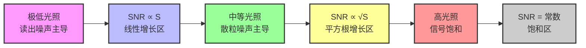

#### 4.4 为什么低光照条件下信噪比会急剧下降？

低光照条件下信噪比急剧下降的根本原因在于**信号强度的指数级衰减与噪声的相对稳定性**。我们可以从几个方面来理解这一现象：

**信号衰减的非线性效应**：当光照强度降低到原来的1/100时，信号强度 $S$ 也降低到原来的1/100。在散粒噪声主导区域，信噪比从 $\sqrt{S}$ 变为 $\sqrt{S/100} = \sqrt{S}/10$，即信噪比下降了10倍（20dB）。

**噪声的相对重要性变化**：在正常光照下，散粒噪声通常是主要噪声源。但在低光照下，读出噪声和暗电流噪声的相对贡献变得显著。例如，如果正常光照下 $S=10000$ 电子，$\sigma_{\text{read}}=10$ 电子，则散粒噪声 $\sqrt{10000}=100$ 电子占主导。但在低光照下 $S=100$ 电子时，散粒噪声 $\sqrt{100}=10$ 电子与读出噪声相当，总噪声 $\sqrt{10^2+10^2}=14.1$ 电子，信噪比从100下降到7.1。

**光子统计的量子极限**：根据量子力学原理，光子到达的随机性存在一个根本极限。即使使用理想的无噪声传感器，由于光子散粒噪声的存在，信噪比也不可能超过 $\sqrt{S}$。在低光照下，这个量子极限本身就限制了可达到的最佳信噪比。

#### 4.5 低信噪比对图像质量的具体影响有哪些？

低信噪比对图像质量的影响是多方面的，主要体现在以下几个视觉和测量特性上：

**细节丢失与空间分辨率下降**：噪声会淹没微弱的图像细节，使得边缘变得模糊，纹理信息丢失。在极端情况下，整个图像可能看起来像是被一层"雪花"覆盖。

**色彩失真与饱和度降低**：噪声会污染颜色通道，导致色彩偏移和不自然的色斑。特别是在阴影区域，本应平滑的渐变可能被噪声破坏成斑驳的图案。

**动态范围压缩**：噪声限制了可检测的最小信号水平，从而压缩了图像的有效动态范围。暗部细节被噪声淹没，亮部可能因增益调整而过曝。

**测量精度下降**：对于科学成像和机器视觉应用，噪声会引入测量误差，降低定量分析的准确性。例如，在荧光显微镜中，低信噪比会使细胞结构的定量测量变得不可靠。

**视觉疲劳**：人眼对噪声特别敏感，长时间观看高噪声图像会导致视觉疲劳和不适。

#### 4.6 如何改善低光照条件下的信噪比？

改善低光照条件下信噪比的技术可以分为硬件优化和算法处理两大类：

**硬件优化策略**：
- **增大像素尺寸**：更大的像素可以收集更多光子，提高信号强度。现代传感器通过背照式（BSI）和堆叠式设计在保持小像素尺寸的同时提高光子收集效率。
- **降低读出噪声**：采用相关双采样（CDS）、四晶体管像素设计等技术减少读出电路的噪声贡献。
- **优化量子效率**：通过微透镜阵列、彩色滤光片优化和抗反射涂层提高光子到电子的转换效率。
- **冷却传感器**：降低温度可以显著减少暗电流噪声，每降低7-10°C，暗电流减少约一半。

**曝光控制策略**：
- **延长曝光时间**：增加积分时间可以累积更多光子，但可能引入运动模糊。
- **提高ISO增益**：电子放大可以增强弱信号，但同时也会放大噪声，需要权衡。
- **多帧平均**：拍摄多张图像并求平均，可以将随机噪声降低 $\sqrt{N}$ 倍（N为帧数）。

**算法处理技术**：
- **时域降噪**：利用视频序列的时间相关性分离信号与噪声。
- **空域滤波**：使用自适应滤波器在保持边缘的同时平滑均匀区域。
- **深度学习降噪**：基于神经网络的降噪算法可以在极低信噪比条件下恢复图像细节。
- **计算摄影技术**：如HDR合成、括号曝光等融合不同曝光参数下的多张图像。

#### 4.7 现代图像传感器技术如何应对低光照挑战？

现代图像传感器通过一系列创新技术来应对低光照成像的挑战：

**背照式（BSI）技术**：将光电二极管置于电路层上方，避免了金属布线对光线的阻挡，量子效率从传统FSI的约60%提高到90%以上。

**堆叠式传感器**：将像素层与处理电路层分离并垂直堆叠，为每个像素提供更多电路空间，支持更复杂的噪声抑制技术。

**全局快门与卷帘快门优化**：全局快门消除了运动伪影，但通常噪声较高；现代传感器通过混合设计在两者之间取得平衡。

**像素合并技术**：将相邻像素的信号合并，等效于增大像素尺寸，提高低光照下的信噪比。

**片上HDR技术**：在同一帧内使用不同曝光时间或增益设置，扩展动态范围同时保持低噪声。

**深度学习ISP**：将神经网络集成到图像信号处理器中，实现实时的智能降噪和增强。

#### 4.8 信噪比在相机性能评估中的实际意义是什么？

信噪比不仅是理论指标，在实际相机性能评估中具有多重重要意义：

**图像质量量化**：信噪比提供了客观、可重复的图像质量度量标准，替代了主观的视觉评价。

**系统设计指导**：帮助工程师在像素尺寸、读取速度、功耗和成本之间做出权衡决策。

**应用场景匹配**：不同应用对信噪比的要求不同。例如，天文摄影可能需要SNR>30dB，而监控摄像头在SNR>20dB时即可接受。

**标准化测试**：业界标准如EMVA 1288和ISO 15739定义了信噪比的测量方法，确保不同厂商产品之间的可比性。

**算法开发基准**：降噪和增强算法的效果可以通过信噪比改善程度来客观评估。

**产品分级依据**：高端专业相机通常具有更好的低光照信噪比性能，这反映在价格和市场定位上。

**标准答案：**

相机的信噪比（SNR）是衡量图像传感器成像品质的核心指标，它量化了有效信号强度与背景噪声水平之间的相对关系。在低光照条件下，信噪比面临严峻挑战，主要因为信号强度指数级衰减而噪声相对稳定。光子散粒噪声、暗电流噪声和读出噪声的共同作用导致信噪比急剧下降，表现为图像细节丢失、色彩失真、动态范围压缩等质量问题。

现代图像传感器通过背照式技术、堆叠式设计、像素合并和智能算法等技术手段来改善低光照性能。信噪比不仅是理论指标，更是相机系统设计、性能评估和应用匹配的重要依据。理解信噪比与光照强度的非线性关系，掌握噪声源的物理机制，对于优化低光照成像系统和开发相关算法具有关键意义。

---
### 5.  什么是相机的动态范围？在什么场景下需要高动态范围（HDR）相机？

#### 5.1 什么是相机的动态范围？

相机的动态范围（Dynamic Range）是指相机传感器或成像系统能够同时记录的最亮区域（高光）与最暗区域（阴影）之间的亮度比值。它反映了相机对极端明暗差异的捕捉能力，衡量了相机单次曝光能够记录的亮度跨度范围。

**技术定义**：动态范围通常用分贝（dB）或曝光档数（stops）来表示。一个曝光档表示亮度翻倍，例如，12档的动态范围意味着相机可以记录从最暗到最亮之间 $2^{12}=4096$ 倍的亮度差异。

**物理原理**：动态范围由传感器的最小可检测信号（噪声下限）和最大可记录信号（饱和上限）决定。公式可以表示为：
$$DR = 20\log_{10}\left(\frac{S_{\text{max}}}{S_{\text{min}}}\right) \text{ dB}$$
其中 $S_{\text{max}}$ 是饱和信号量，$S_{\text{min}}$ 是噪声下限信号量。

**可视化表示**：
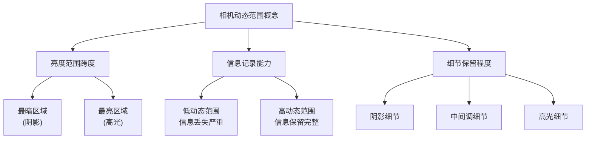

#### 5.2 为什么动态范围对相机很重要？

动态范围直接影响图像的质量和真实性。当相机动态范围不足时，会出现两种典型问题：

**过曝（Overexposure）**：场景中最亮的部分超出传感器的记录能力，导致高光区域变成纯白色，失去所有细节。例如拍摄天空时，云层细节完全消失，变成一片惨白。

**欠曝（Underexposure）**：场景中最暗的部分低于传感器的噪声下限，导致阴影区域变成纯黑色，纹理和细节无法呈现。例如在逆光环境下，人物面部完全变黑，看不到任何特征。

**理想情况**：高动态范围相机能够同时保留从最暗阴影到最亮高光的完整细节，呈现更接近人眼视觉的真实场景。人眼的动态范围约为20-24档，而传统相机的动态范围通常只有10-14档，这就是为什么相机拍摄的照片往往不如人眼看到的场景丰富。

#### 5.3 什么是高动态范围（HDR）相机？

高动态范围（High Dynamic Range，HDR）相机是指具有远超传统相机动态范围能力的成像系统。HDR技术通过多种方法扩展动态范围：

**技术实现方式**：
1. **多曝光融合**：在同一场景下拍摄多张不同曝光时间的照片，然后将这些照片融合成一张HDR图像。这是最常见的HDR实现方式。
2. **传感器技术改进**：如双增益传感器、对数响应传感器等，通过硬件设计提高单次曝光的动态范围。
3. **事件相机**：基于神经形态原理的相机，采用异步像素操作和对数光电转换，天生具有极高的动态范围。
4. **计算摄影技术**：通过算法处理扩展动态范围，如HDR-NeRF、HDR-GS等基于神经辐射场的方法。

**HDR相机特性**：
- 能够记录高达20档以上的动态范围
- 在极端光照条件下仍能保留细节
- 支持更宽的色域和更丰富的色彩表现
- 适用于专业摄影、科学成像、工业检测等高端应用

#### 5.4 在什么场景下需要高动态范围（HDR）相机？

HDR相机在以下场景中具有关键应用价值：

**5.4.1 逆光拍摄场景**
这是最典型的HDR应用场景。当主体背对强光源（如太阳、窗户）时，相机要么让背景过曝以保留主体细节，要么让主体欠曝以保留背景细节。HDR相机能够同时解决这两个问题，例如：
- 日出日落时拍摄风景，同时保留天空云彩细节和地面景物
- 室内靠窗拍摄，同时保留窗外风景和室内人物细节
- 背光人像摄影，避免人物面部变黑

**5.4.2 大光比风景摄影**
当场景中存在明亮天空和昏暗地面的强烈对比时，传统相机难以同时记录两者细节：
- 山川湖海景观，天空与水面/地面光线差异显著
- 城市建筑摄影，天空与建筑物形成强烈对比
- 户外街景，阳光直射区域与阴影区域亮度差异大

**5.4.3 室内明暗交错环境**
室内环境中经常存在局部强光和大量阴影：
- 咖啡馆、餐厅等有窗户的环境
- 博物馆、美术馆等有重点照明的场所
- 教室、会议室等有投影或黑板的环境

**5.4.4 夜景与弱光摄影**
夜景拍摄面临复杂的光照条件：
- 城市夜景中的霓虹灯、路灯与黑暗背景
- 星空摄影中的星星与黑暗天空
- 室内弱光环境中的局部光源

**5.4.5 专业与工业应用**
HDR相机在专业领域有特殊需求：
- **天文观测**：同时捕捉明亮星体和微弱星云，如论文《Neuromorphic Cameras in Astronomy》所示，神经形态相机能够同时捕获暗淡和明亮的宇宙源
- **自动驾驶**：在强烈阳光下和隧道阴影中都能清晰识别道路和障碍物
- **医学成像**：在X光、内窥镜等应用中需要捕捉广泛的亮度范围
- **工业检测**：检测高反光表面的缺陷，如金属、玻璃等
- **安防监控**：在昼夜交替、逆光等复杂光照条件下保持清晰监控

**5.4.6 动态场景HDR成像**
如论文《Event-assisted 12-stop HDR Imaging of Dynamic Scene》所述，传统HDR融合方法在动态场景中面临对齐困难，而事件相机辅助的HDR系统能够：
- 处理运动物体引起的重影问题
- 在极端曝光差异下保持图像质量
- 应用于体育摄影、野生动物摄影等动态场景

#### 5.5 HDR技术的发展趋势与挑战

**技术发展趋势**：
1. **实时HDR处理**：随着计算能力的提升，实时HDR处理成为可能
2. **深度学习增强**：基于神经网络的HDR重建技术，如HDR-NeRF、HDR-GS等
3. **硬件传感器创新**：对数传感器、双增益传感器、事件相机等新型传感器
4. **多模态融合**：结合RGB、深度、事件等多种传感器数据

**技术挑战**：
1. **计算复杂度**：HDR处理需要大量计算资源
2. **运动伪影**：动态场景中的对齐和重影问题
3. **色调映射**：将HDR图像压缩到显示设备可显示范围的技术挑战
4. **标准化**：HDR格式和显示标准的统一

**应用展望**：
随着HDR技术的成熟，它正在从专业领域向消费级产品普及。智能手机、消费级相机都开始集成HDR功能，未来HDR将成为成像系统的标准配置，为用户提供更真实、更丰富的视觉体验。

---

**总结**：相机的动态范围是其能够同时记录的最亮与最暗区域之间的亮度比值，决定了相机在复杂光照条件下的成像能力。高动态范围（HDR）相机通过多曝光融合、传感器技术改进、事件相机等多种技术手段扩展动态范围，在逆光拍摄、大光比风景、室内明暗交错、夜景摄影以及天文观测、自动驾驶、工业检测等专业领域具有关键应用价值。随着计算摄影和深度学习技术的发展，HDR技术正朝着实时处理、高质量重建的方向发展，为用户提供更接近真实世界的视觉体验。

### 6. 相机接口（GigE Vision, USB3 Vision, Camera Link, CoaXPress）各有什么优缺点？如何根据传输距离、带宽和成本选择？

#### 6.1 什么是GigE Vision接口？它的主要技术特点是什么？
GigE Vision是基于千兆以太网（Gigabit Ethernet）的相机接口标准，它利用标准以太网协议进行图像数据传输。其技术特点包括使用Cat5e/Cat6标准网线，支持高达1Gbps的传输速率（理论值约100MB/s），传输距离可达100米（无中继），并且兼容GigE Vision V2.0协议及GenICam标准。这种接口的最大优势在于标准化程度高，几乎所有PC和工控机都具备以太网接口，兼容性强。

#### 6.2 GigE Vision接口的主要优点和缺点是什么？
GigE Vision的优点在于传输距离较长（100米），使用标准以太网线缆成本低廉，系统集成简单，支持多相机网络连接，并且线缆灵活易于布线。然而其缺点也比较明显：带宽相对有限（1Gbps），对于高分辨率、高帧率应用可能不足；数据传输存在一定延迟；需要CPU参与数据处理，可能占用系统资源；在电磁干扰较强的工业环境中稳定性可能受影响。

#### 6.3 USB3 Vision接口的技术规格和特点是什么？
USB3 Vision是基于USB 3.0/3.1/3.2接口的工业相机标准，通常使用USB 3.1 Gen 1接口，提供高达5Gbps的理论传输速率（实际约380-440MB/s）。该标准通过定义统一的设备检测、图像传输和相机控制协议，实现了即插即用的兼容性。USB3 Vision支持热插拔，接口普及度高，几乎所有的现代计算机都配备USB接口。

#### 6.4 USB3 Vision接口的优势和局限性分别是什么？
USB3 Vision的主要优势包括较高的传输带宽（5Gbps），适合中高速应用；接口标准化程度高，兼容性好；支持热插拔，使用方便；成本相对较低。但其局限性在于传输距离较短（通常3-5米），对于长距离应用需要中继器；USB线缆相对脆弱，在工业环境中耐久性可能不足；带宽共享可能导致多设备同时使用时性能下降；电磁兼容性（EMC）性能一般。

#### 6.5 Camera Link接口的设计理念和技术特性是什么？
Camera Link是专为高端工业视觉设计的高速数字接口标准，采用专用的图像采集卡和线缆构建封闭式传输系统。它基于RS-422/485差分电平逻辑，支持多种配置模式（Base、Medium、Full、Deca），传输速率可达6.8Gbps。Camera Link接口成熟度高，兼容性好，在系统运行时传输稳定、错误率低。

#### 6.6 Camera Link接口的优点和缺点有哪些？
Camera Link的优点非常突出：传输速度极快，延迟极低；传输稳定性高，适合严苛工业环境；支持线缆供电（PoCL），无需额外电源线；协议成熟，兼容性好。但其缺点也很明显：需要专用采集卡，系统成本高；传输距离有限（通常10米以内）；线缆和连接器专用，成本较高；系统扩展性相对较差。

#### 6.7 CoaXPress接口的技术创新点是什么？
CoaXPress是一种非对称的高速点对点串行通信数字接口标准，它结合了同轴电缆的简易性和高速串行数据技术。通过单根同轴电缆实现高达12.5Gbps（CXP-12）的数据传输速率，传输距离可达50-170米。CoaXPress支持通过同轴电缆同时传输数据和供电，简化了系统连接。

#### 6.8 CoaXPress接口的主要优势和不足是什么？
CoaXPress的主要优势包括：极高的传输带宽（最高12.5Gbps）；超长的传输距离（50-170米）；单根同轴电缆同时传输数据和供电；抗干扰能力强，适合工业环境；支持热插拔。不足之处在于：同轴电缆和连接器成本较高；需要专用采集卡；系统配置相对复杂；对于普通应用可能显得"大材小用"。

#### 6.9 如何根据传输距离需求选择相机接口？
传输距离是选择相机接口的关键因素之一。对于超短距离（3-5米）应用，USB3 Vision是最经济的选择；中等距离（10-30米）可以考虑Camera Link；长距离（50-100米）应用适合GigE Vision；超长距离（50-170米）则需要CoaXPress。如果距离超过170米，可能需要考虑光纤扩展方案，如CoaXPress-over-Fiber技术。

#### 6.10 如何根据带宽需求选择合适的接口？
带宽需求直接影响接口选择：对于低带宽应用（<100MB/s），GigE Vision足够；中等带宽（100-400MB/s）适合USB3 Vision；高带宽（400-800MB/s）需要Camera Link；超高带宽（>800MB/s）则应选择CoaXPress。需要注意的是，实际可用带宽通常低于理论值，需要考虑20-30%的余量。

#### 6.11 成本因素在接口选择中如何权衡？
成本考量需要从多个维度分析：GigE Vision总体成本最低，线缆便宜，无需专用硬件；USB3 Vision成本适中，接口普及，但可能需要高质量线缆；Camera Link成本较高，需要专用采集卡和线缆；CoaXPress成本最高，专用硬件和同轴电缆都较昂贵。选择时需要平衡性能需求和预算限制，避免"过度设计"或"性能不足"。

#### 6.12 不同应用场景下如何综合选择相机接口？
对于消费电子、教育科研等成本敏感型应用，USB3 Vision是最佳选择；工厂自动化、质量检测等工业应用，根据具体需求可在GigE Vision和Camera Link之间选择；高速运动分析、科学成像等高带宽需求应用，Camera Link是传统选择；而超高速、超长距离的专用工业检测，CoaXPress提供最优性能。多相机系统通常优先考虑GigE Vision，因其网络拓扑灵活性最佳。

#### 6.13 未来相机接口技术的发展趋势是什么？
相机接口技术正朝着更高带宽、更长距离、更低延迟的方向发展。GigE Vision正在向10GigE、25GigE演进；USB3 Vision向USB4发展；Camera Link有Camera Link HS版本；CoaXPress则有CoaXPress 2.0标准。同时，基于光纤的传输技术（如X over Fiber）正在兴起，为超长距离、超高带宽应用提供新选择。软件定义接口和无线传输技术也在探索中。

**标准答案：**

**【接口对比分析】**
四种主流工业相机接口各有特色，适用于不同的应用场景：

**GigE Vision**：基于标准以太网，传输距离长（100米），成本最低，适合分布式多相机系统和一般工业应用，但带宽有限（1Gbps）。

**USB3 Vision**：基于USB 3.0+标准，带宽适中（5Gbps），即插即用方便，成本较低，适合中速应用和实验室环境，但传输距离短（3-5米）。

**Camera Link**：专用高速接口，带宽高（6.8Gbps），延迟极低，稳定性好，适合高速运动分析和严苛工业环境，但需要专用硬件，成本较高。

**CoaXPress**：基于同轴电缆，带宽最高（12.5Gbps），传输距离最长（50-170米），抗干扰能力强，适合超高速、超长距离专用检测，但系统成本最高。

**【选择决策矩阵】**
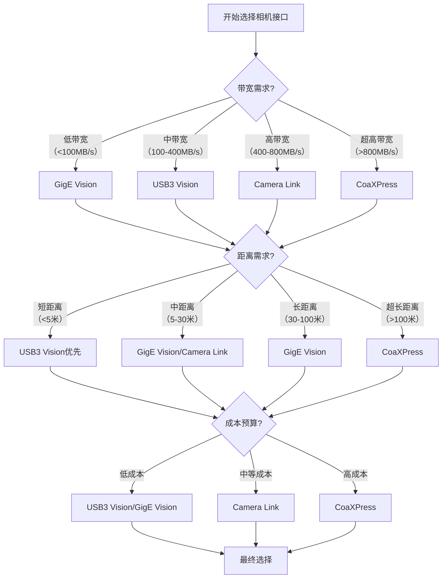

**【技术参数对比表】**
| 接口类型 | 理论带宽 | 实际带宽 | 传输距离 | 线缆类型 | 是否需要专用卡 | 典型应用 |
|---------|---------|---------|---------|---------|---------------|---------|
| GigE Vision | 1 Gbps | ~100 MB/s | 100米 | Cat5e/Cat6网线 | 否 | 一般工业检测、监控 |
| USB3 Vision | 5 Gbps | ~400 MB/s | 3-5米 | USB 3.0线缆 | 否 | 实验室、消费电子 |
| Camera Link | 6.8 Gbps | ~680 MB/s | 10米 | 专用屏蔽线 | 是 | 高速运动分析、精密检测 |
| CoaXPress | 12.5 Gbps | ~1.2 GB/s | 50-170米 | 同轴电缆 | 是 | 超高速工业检测、科学成像 |

**【实践建议】**
在实际项目中选择相机接口时，建议遵循以下步骤：首先明确应用的具体带宽需求，计算所需的最小传输速率；然后评估安装环境中的传输距离要求；接着考虑系统的总体预算限制；最后综合权衡性能、成本和可靠性。对于不确定的情况，可以先采用GigE Vision或USB3 Vision进行原型验证，再根据实际性能需求升级到更高速的接口。随着技术发展，接口选择也需要考虑未来的扩展性和兼容性。

---
### 7. 镜头的焦距、光圈（F值）、工作距离、视野之间有什么关系？如何根据工作距离和视野计算所需焦距？

#### 7.1 什么是镜头的基本光学参数及其物理意义？
镜头的基本光学参数包括焦距、光圈、工作距离和视野。焦距（Focal Length）是指镜头光学中心到成像平面（传感器）的距离，决定了图像的放大率和视角。光圈（Aperture）用F值表示，定义为焦距与镜头有效孔径直径的比值（$F = f/D$），控制着进入镜头的光线量。工作距离（Working Distance, WD）是镜头前表面到被摄物体的距离。视野（Field of View, FOV）是镜头在特定工作距离下能够拍摄到的实际场景范围。

#### 7.2 焦距与视野之间有什么直接关系？
焦距与视野之间存在反比关系。在相同的工作距离下，焦距越长，视野范围越小；焦距越短，视野范围越大。这是因为长焦距镜头具有更高的放大倍率，将更多的细节集中在传感器上，从而覆盖的实际场景范围变小。短焦距镜头（广角镜头）则能覆盖更宽广的场景。

#### 7.3 工作距离如何影响视野范围？
工作距离与视野范围成正比关系。在相同的焦距和传感器尺寸下，工作距离越大，视野范围也越大；工作距离越小，视野范围越小。当镜头远离物体时，同一视角下能够覆盖的实际物理区域自然变大。这种关系可以用简单的几何光学原理解释：工作距离增加时，从镜头顶点发出的光线锥覆盖的实际面积增大。

#### 7.4 光圈（F值）如何与其他参数相互作用？
光圈主要影响景深和进光量，与焦距、工作距离、视野的关系较为间接。光圈值（F值）越小（如f/1.4），表示光圈开孔越大，进光量越多，景深越浅（清晰范围小）。光圈值越大（如f/16），光圈开孔越小，进光量减少，景深越深（清晰范围大）。在相同焦距下，光圈大小会影响图像的明暗和背景虚化程度，但不直接改变视野范围。

#### 7.5 如何用公式表达这些参数之间的关系？
根据几何光学原理，焦距（$f$）、工作距离（$WD$）、传感器尺寸（$S$）和视野（$FOV$）之间的关系可以用以下公式表示：

$$
f = \frac{WD \times S}{FOV}
$$

其中：
- $f$：镜头焦距（单位：mm）
- $WD$：工作距离（单位：mm）
- $S$：传感器尺寸（水平或垂直方向，单位：mm）
- $FOV$：视野范围（对应方向，单位：mm）

这个公式基于相似三角形原理推导而来，是镜头选型的基本计算公式。

#### 7.6 如何根据已知的工作距离和视野计算所需焦距？
计算所需焦距的步骤如下：首先确定应用需求，包括需要拍摄的物体尺寸（视野范围$FOV$）和镜头到物体的距离（工作距离$WD$）。然后了解相机传感器的尺寸（$S$），通常传感器规格会给出对角线尺寸，但实际计算时需要水平或垂直方向的尺寸。将数值代入公式$f = \frac{WD \times S}{FOV}$进行计算。例如，如果工作距离为500mm，视野宽度需要200mm，传感器水平尺寸为8mm，则所需焦距为$f = \frac{500 \times 8}{200} = 20mm$。

#### 7.7 在实际应用中需要考虑哪些修正因素？
实际应用中需要考虑镜头畸变，特别是广角镜头的桶形畸变和长焦镜头的枕形畸变会影响视野边缘的准确性。景深要求会影响光圈选择，进而可能间接影响焦距选择。分辨率需求决定传感器像素密度，过长的焦距可能导致像素利用率不足。机械约束如镜头尺寸、接口类型也会影响最终选择。环境因素如光照条件、工作温度等都需要综合考虑。

#### 7.8 如何选择合适的镜头参数组合？
选择合适的镜头参数需要系统化方法：首先明确应用场景的主要目标（如检测精度、视野范围、工作距离限制）。根据物体尺寸和检测精度计算所需像素分辨率，确定传感器规格。使用公式$f = \frac{WD \times S}{FOV}$计算理论焦距，然后选择最接近的标准焦距镜头。考虑景深需求选择适当的光圈范围，通常工业应用中会选择中等光圈（f/4-f/8）以平衡景深和图像质量。最后进行实际测试验证，检查图像边缘清晰度、畸变程度和整体成像质量。

#### 7.9 有哪些常见的应用场景和对应的参数选择策略？
在机器视觉检测中，通常需要较大的视野和中等工作距离，选择短焦距镜头（8-16mm）配合适当光圈。显微成像需要极短的工作距离和放大倍率，使用专用显微镜头或长焦距镜头配合延长管。安防监控需要宽广的视野覆盖，选择短焦距广角镜头（2.8-6mm）。远距离拍摄如体育摄影选择长焦距镜头（200-600mm）以获得细节特写。每个场景都需要根据具体需求平衡各参数关系。

标准答案：

**【基本原理】**
镜头的光学参数构成了一个相互关联的系统，其中焦距、工作距离、视野和传感器尺寸通过几何光学原理紧密相连。光圈值则主要控制进光量和景深，与其他参数形成间接的相互作用关系。

**示意图：镜头参数几何关系**
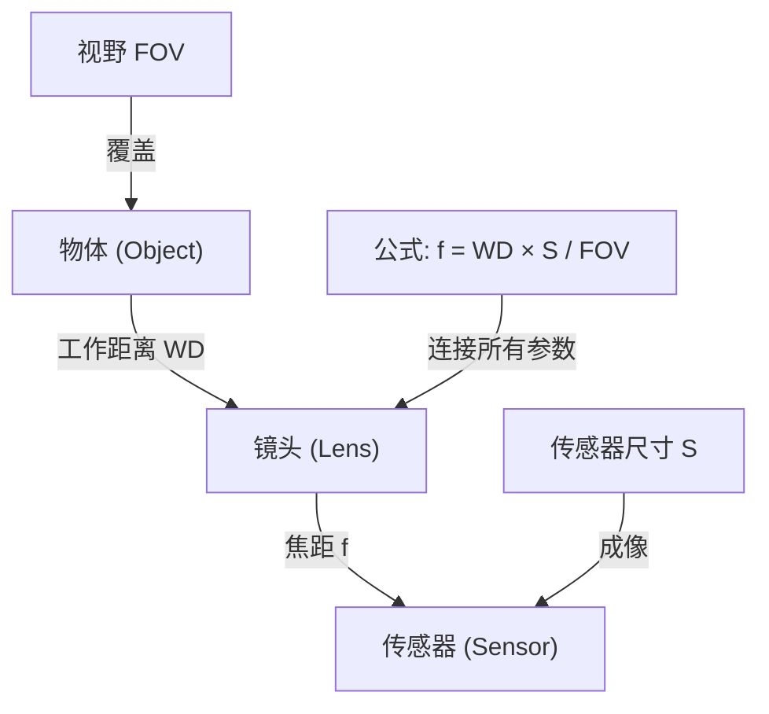

**【核心关系】**
焦距、工作距离和视野之间的基本关系可以用以下公式精确描述：

$$
f = \frac{WD \times S}{FOV}
$$

其中$f$为焦距，$WD$为工作距离，$S$为传感器尺寸（水平或垂直方向），$FOV$为对应方向的视野范围。这个公式基于相似三角形原理，是镜头选型的数学基础。

**参数相互作用矩阵：**
| 参数变化 | 对视野的影响 | 对景深的影响 | 对图像亮度的影响 |
|---------|-------------|-------------|----------------|
| 焦距增加 | 视野减小 | 景深变浅 | 无直接影响 |
| 工作距离增加 | 视野增大 | 景深变深 | 无直接影响 |
| 光圈增大（F值减小） | 无直接影响 | 景深变浅 | 亮度增加 |
| 传感器尺寸增大 | 视野增大（在相同焦距下） | 无直接影响 | 无直接影响 |

**【焦距计算步骤】**
根据工作距离和视野计算所需焦距的具体步骤如下：首先明确应用需求，确定需要拍摄的物体尺寸（视野$FOV$）和镜头到物体的距离（工作距离$WD$）。然后查阅相机规格，获取传感器的实际尺寸$S$（注意区分对角线尺寸和水平/垂直尺寸）。将数值代入公式$f = \frac{WD \times S}{FOV}$进行计算。得到理论焦距后，选择最接近的标准焦距镜头。最后进行实际测试验证，确保图像质量满足要求。

**【实际应用示例】**
假设一个工业检测场景：需要检测宽度为150mm的电路板，工作距离限制为300mm，相机传感器水平尺寸为6.4mm（1/2英寸传感器的典型值）。计算所需焦距：$f = \frac{300 \times 6.4}{150} = 12.8mm$。选择最接近的标准焦距12mm镜头。如果同时需要较大的景深，可以选择光圈f/8的设置。

**【注意事项】**
在实际应用中，镜头畸变（特别是广角镜头的桶形畸变）会影响视野边缘的准确性，需要在计算时留出适当余量。分辨率需求决定了传感器像素密度，过长的焦距可能导致像素利用率不足。机械约束如镜头尺寸、接口类型也会影响最终选择。环境因素如光照条件、工作温度等都需要综合考虑。

**【进阶理解】**
对于复杂的光学系统，还需要考虑主点位置、像方焦距与物方焦距的区别。在近距摄影中，当工作距离接近焦距时，需要采用更精确的透镜公式：$\frac{1}{f} = \frac{1}{u} + \frac{1}{v}$，其中$u$为物距，$v$为像距。对于变焦镜头，焦距变化会同时改变视野和工作距离的关系，需要根据具体变焦位置重新计算。

---

### 8.  什么是镜头的景深？哪些因素影响景深？在检测厚度不一致的物体时，如何保证成像清晰？

#### 8.1 什么是镜头的景深？
镜头的景深（Depth of Field, DoF）是指在成像平面上能够保持可接受的清晰度（即焦点前后）的物体距离范围。当镜头对某个特定距离的物体准确对焦时，在这个焦点平面前后一定范围内的物体在图像中看起来也是清晰的，这个范围就是景深。景深可以理解为"视觉上清晰的范围"，而不是一个绝对意义上的清晰界限。

**示意图：景深的基本概念**
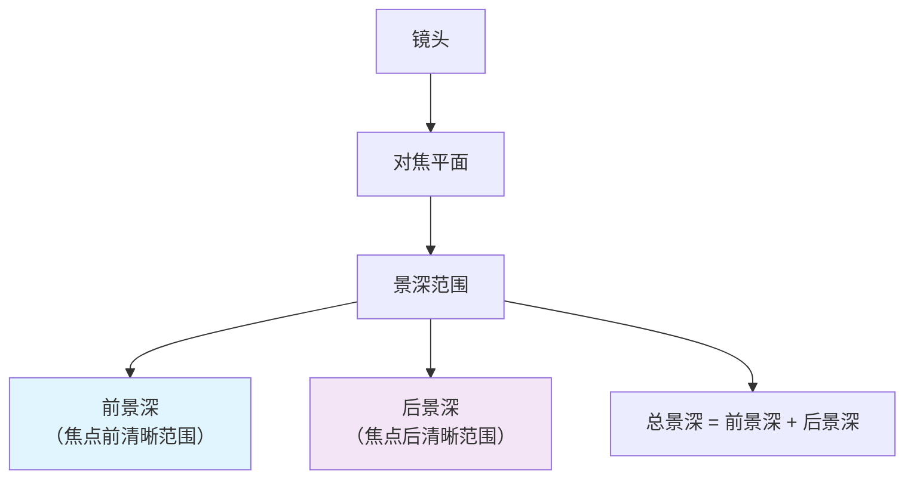

#### 8.2 哪些因素影响景深？
景深受到三个主要因素的综合影响。在机器视觉选型中，理解这些参数与景深的正反比关系至关重要：

1.  **光圈大小（Aperture / F-number）**：
    *   **关系**：景深与光圈F值成**正比**。
    *   **表现**：F值越大（实际光圈开孔越小，如 f/11），景深越深；F值越小（实际光圈开孔越大，如 f/1.4），景深越浅。

2.  **焦距（Focal Length）**：
    *   **关系**：景深与焦距的平方成**反比**。
    *   **表现**：焦距越长（如 50mm 镜头），景深越浅；焦距越短（如 8mm 广角镜头），景深越深。

3.  **工作距离（Working Distance / Object Distance）**：
    *   **关系**：景深与工作距离的平方近似成**正比**。
    *   **表现**：相机距离物体越远，景深越深；进行微距拍摄或距离物体很近时，景深极浅。

**物理公式（近似）：**
在工作距离 $s$ 远大于焦距 $f$ 的工业应用场景下，总景深 $\Delta L$ 的计算公式通常简化为：

$$\Delta L \approx \frac{2 N c s^2}{f^2}$$

其中：
*   **$N$**：镜头的光圈F值（F-number）
*   **$c$**：容许弥散圆直径（Circle of Confusion，通常取像元尺寸的2-3倍）
*   **$s$**：工作距离（对焦距离）
*   **$f$**：镜头焦距

**参数影响总结表：**

| 变量 | 变化方向 | 景深变化 | 备注 |
| :--- | :--- | :--- | :--- |
| **光圈 F值 ($N$)** | 变大 (光圈收小) | **变深 ↑** | 增加景深最常用的手段，但需增加曝光时间 |
| **焦距 ($f$)** | 变长 | **变浅 ↓** | 长焦镜头对对焦精度要求极高 |
| **工作距离 ($s$)** | 变远 | **变深 ↑** | 远离物体可以获得更大的清晰范围 |
| **像元/弥散圆 ($c$)** | 变大 | **变深 ↑** | 较低分辨率的系统视觉上对失焦更不敏感 |

---

#### 8.3 在检测厚度不一致的物体时，如何保证成像清晰？
当检测厚度不一致的物体时，需要扩展景深以确保整个物体都在清晰范围内。以下是几种常用方法：

**8.3.1 光学方法：缩小光圈**
通过减小光圈（增大f值）来增加景深。这是最直接的方法，但有两个主要限制：1) 减小光圈会减少进光量，需要更长的曝光时间或更高的ISO，可能导致运动模糊或噪声增加；2) 过小的光圈会因衍射效应降低图像分辨率。

**8.3.2 机械方法：倾斜镜头或传感器**
根据沙姆定律（Scheimpflug principle），当镜头平面、成像平面和被摄物体平面相交于一条直线时，整个倾斜的物体平面都能清晰成像。在工业检测中，可以通过倾斜镜头或传感器来匹配物体的倾斜表面。

**沙姆定律示意图**
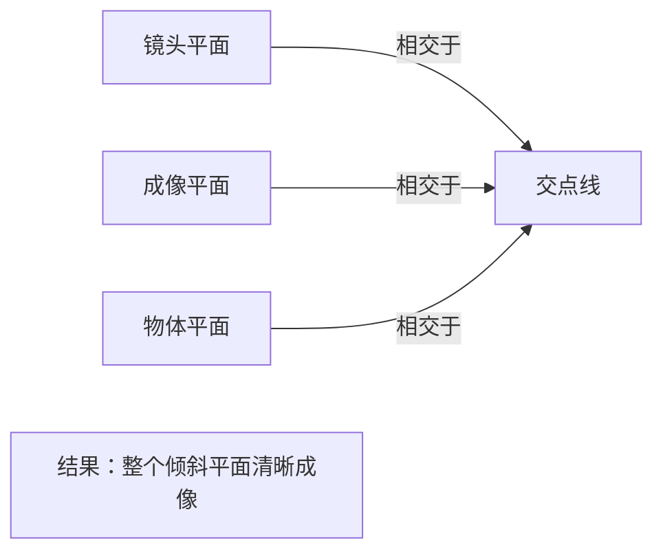

**8.3.3 电子方法：焦点堆叠（Focus Stacking）**
对同一场景在不同焦点位置拍摄多张图像，然后通过算法将这些图像中清晰的部分合成一张全清晰的图像。这种方法特别适合静态物体的高精度检测。

**8.3.4 计算摄影方法：波前编码（Wavefront Coding）**
在光学系统中加入特殊的光学元件（如立方相位板），使点扩散函数（PSF）对离焦不敏感，然后通过数字图像处理恢复清晰图像。这种方法可以在不牺牲光圈的情况下扩展景深。

**8.3.5 主动对焦方法：自动对焦扫描**
对于动态或实时检测场景，可以使用自动对焦系统在整个物体厚度范围内进行快速扫描，确保每个深度层面都能被清晰捕捉。

**8.3.6 深度学习方法：全焦点图像合成**
利用深度学习模型直接从单张或多张部分对焦的图像中重建全清晰的图像。这种方法结合了计算机视觉和计算摄影的最新进展。

#### 8.4 实际应用中的综合考虑
在实际工业检测中，需要根据具体需求选择合适的方法：

**对于高精度静态检测**：焦点堆叠结合小光圈是最可靠的选择，虽然耗时但能获得最佳图像质量。

**对于动态或实时检测**：可能需要结合主动对焦、计算摄影和深度学习的方法，在速度和质量之间找到平衡。

**对于大范围厚度变化**：沙姆定律的倾斜调整可能是最有效的解决方案，特别是当物体表面是平面但倾斜的情况。

**对于低光照环境**：可能需要使用大光圈镜头配合计算摄影技术，或者增加照明强度。

---

**总结**：镜头的景深是焦点前后能够保持可接受清晰度的范围，受光圈大小、焦距和拍摄距离等因素影响。在检测厚度不一致的物体时，可以通过缩小光圈、应用沙姆定律、使用焦点堆叠、波前编码技术、自动对焦扫描或深度学习方法等多种手段来扩展有效景深，确保整个物体都能清晰成像。选择哪种方法取决于具体的检测要求、物体特性、环境条件和可用的技术资源。在实际应用中，往往需要综合使用多种技术来达到最佳的检测效果。

### 9. 什么是远心镜头？它和普通镜头相比有什么优势？在什么场景下必须使用？

#### 9.1 什么是远心镜头，它的光学原理是什么？
远心镜头是一种特殊设计的工业镜头，其核心原理在于**使主光线平行于光轴**。在普通镜头中，光线从物体不同位置以不同角度进入镜头，导致"近大远小"的透视效应。而远心镜头通过特殊的光学设计（通常将孔径光阑放置在像方焦平面上），使得从物体发出的所有有效光线都以平行于光轴的方向进入镜头，从而消除了透视误差。

**远心镜头的光学原理示意图：**
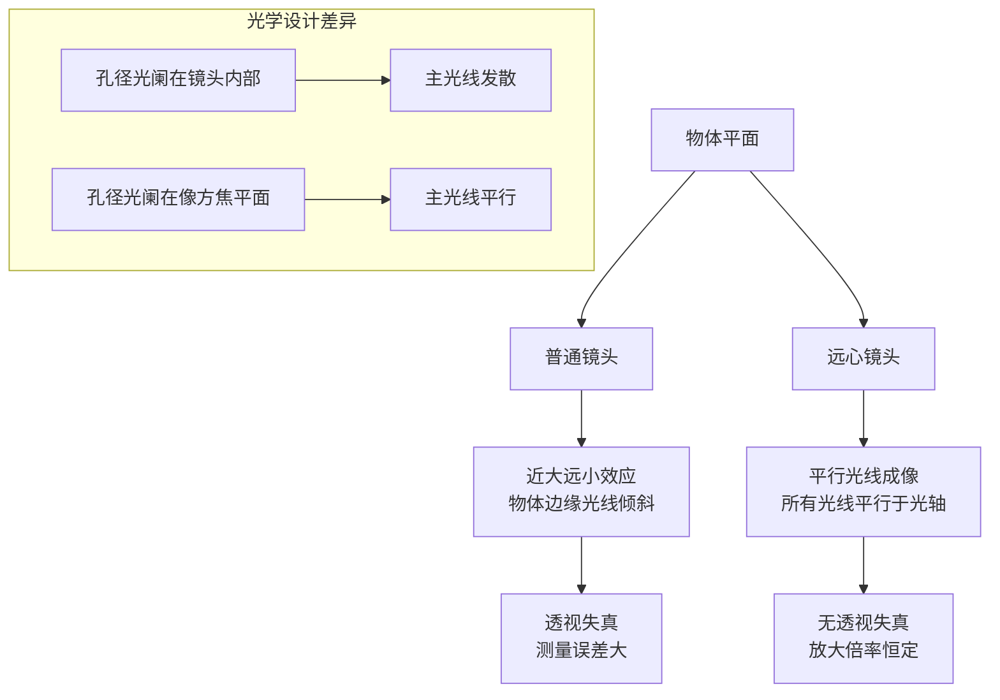

#### 9.2 远心镜头与普通镜头的主要区别是什么？
远心镜头与普通镜头最本质的区别在于**成像几何特性的不同**。普通镜头遵循透视投影原理，物体离镜头越近，在图像传感器上成像越大，这种"近大远小"的特性在工业测量中会引入系统误差。而远心镜头在一定的物距范围内（称为远心景深），图像的放大倍率保持不变，无论物体在景深范围内如何移动，其在图像中的尺寸都保持不变。

具体差异体现在以下几个方面：普通镜头存在明显的透视效应，物体边缘的光线以倾斜角度进入镜头；而远心镜头只接受与光轴平行的光线，物体边缘的光线也被调整为平行方向。这种差异直接导致了普通镜头在测量时会产生视差，而远心镜头则能保持恒定的放大倍率。

#### 9.3 远心镜头的核心优势有哪些？
远心镜头的核心优势主要体现在**测量精度**和**图像一致性**方面。首先，它消除了透视误差，确保了在测量应用中尺寸测量的准确性，特别适合微米级精度的工业检测。其次，远心镜头具有恒定的放大倍率特性，这意味着在景深范围内，物体在图像中的尺寸不会随物距变化而改变，这对于自动化生产线上的零件检测至关重要。

另一个重要优势是**极低的图像畸变**。由于光线平行进入，远心镜头的畸变通常小于0.1%，远低于普通镜头的1-3%。此外，远心镜头通常具有较大的景深，能够同时清晰成像不同高度的物体特征，这在多层结构检测中特别有用。最后，远心镜头的光学设计使其对光源的依赖性降低，配合同轴光源使用时，能够获得均匀的照明效果，减少阴影和反射干扰。

#### 9.4 远心镜头在哪些具体场景下是必须使用的？
远心镜头在需要**高精度尺寸测量**和**无透视成像**的场景下是必须使用的。首先，在半导体行业，芯片、晶圆的尺寸测量、缺陷检测等应用中，微米级的精度要求必须使用远心镜头来消除透视误差。其次，在精密机械加工领域，如螺丝、齿轮、轴承等零件的尺寸检测和形位公差测量，远心镜头能确保测量结果的准确性。

在医疗设备制造中，如手术器械、植入物的尺寸验证和质量控制，远心镜头的高精度特性至关重要。在电子制造业，PCB板上的元件位置、焊点质量、线路宽度等检测都需要远心镜头来保证测量一致性。此外，在光学元件检测、薄膜厚度测量、材料表面缺陷检测等应用中，远心镜头也是不可或缺的工具。

#### 9.5 远心镜头有哪些类型和分类？
远心镜头主要根据其光学设计分为三种类型：**物方远心镜头**、**像方远心镜头**和**双侧远心镜头**。物方远心镜头将孔径光阑放置在像方焦平面上，使得物方主光线平行于光轴，主要应用于物体尺寸测量。像方远心镜头则将孔径光阑放置在物方焦平面上，使得像方主光线平行于光轴，常用于需要将图像投影到特定平面的应用。

双侧远心镜头是前两种的结合，在物方和像方都实现了远心特性，提供了最高的光学性能，但成本也最高。从应用角度还可以分为：测量型远心镜头（强调精度和畸变控制）、检测型远心镜头（强调分辨率和对比度）、以及显微型远心镜头（用于高倍率显微应用）。

#### 9.6 使用远心镜头时需要注意哪些技术要点？
使用远心镜头时需要注意几个关键技术参数。首先是**工作距离**，即镜头前端到被测物体的距离，需要根据具体应用精确设定。其次是**景深范围**，虽然远心镜头景深较大，但仍需确保被测物体在景深范围内。**放大倍率**是另一个关键参数，通常远心镜头的放大倍率是固定的，需要根据被测物体尺寸和传感器分辨率来选择。

**数值孔径（NA）** 决定了镜头的集光能力和分辨率，数值越大，分辨率越高，但景深越小。**分辨率**需要与相机传感器匹配，确保系统能够检测到所需的最小特征。**照明方式**也特别重要，由于远心镜头只接受平行光线，通常需要配合同轴光源或平行背光照明，以获得最佳的成像效果。

#### 9.7 远心镜头的局限性是什么？
尽管远心镜头有许多优势，但也存在一些局限性。首先是**成本较高**，由于其复杂的光学设计和精密制造工艺，远心镜头的价格通常是普通镜头的数倍甚至数十倍。其次是**尺寸和重量较大**，远心镜头通常需要较大的光学元件来实现平行光路，导致镜头体积较大，不适合空间受限的应用。

**视场相对较小**是另一个限制，远心镜头为了保持光学性能，通常只能提供较小的视场范围。**对光源的特殊要求**也是一个考虑因素，需要配合特定的照明系统才能发挥最佳性能。最后，**安装和调试复杂度较高**，需要精确调整工作距离、照明角度等参数，对操作人员的技术要求较高。

#### 9.8 如何选择适合的远心镜头？
选择远心镜头需要考虑多个因素的综合平衡。首先要明确**测量精度要求**，确定所需的精度等级和最小可检测特征尺寸。其次要考虑**被测物体尺寸**，根据物体大小确定所需的视场范围和放大倍率。**工作距离**需要根据实际安装空间确定，确保镜头能够安装在合适的位置。

**相机传感器参数**是另一个关键因素，需要匹配传感器的尺寸、像素大小和分辨率。**照明条件**也需要预先考虑，确定使用何种照明方式（同轴光、背光等）。最后还需要考虑**环境因素**，如振动、温度变化、灰尘等，选择适合工业环境的镜头型号。

**标准答案：**

**【基本原理】**
远心镜头是一种特殊设计的工业光学镜头，其核心特性是通过将孔径光阑放置在像方焦平面上，使得从物体发出的所有有效光线都以平行于光轴的方向进入镜头。这种设计消除了普通镜头固有的透视效应（"近大远小"），在一定的物距范围内保持图像放大倍率恒定，从而实现高精度的尺寸测量和无失真成像。

**远心镜头 vs 普通镜头对比示意图：**
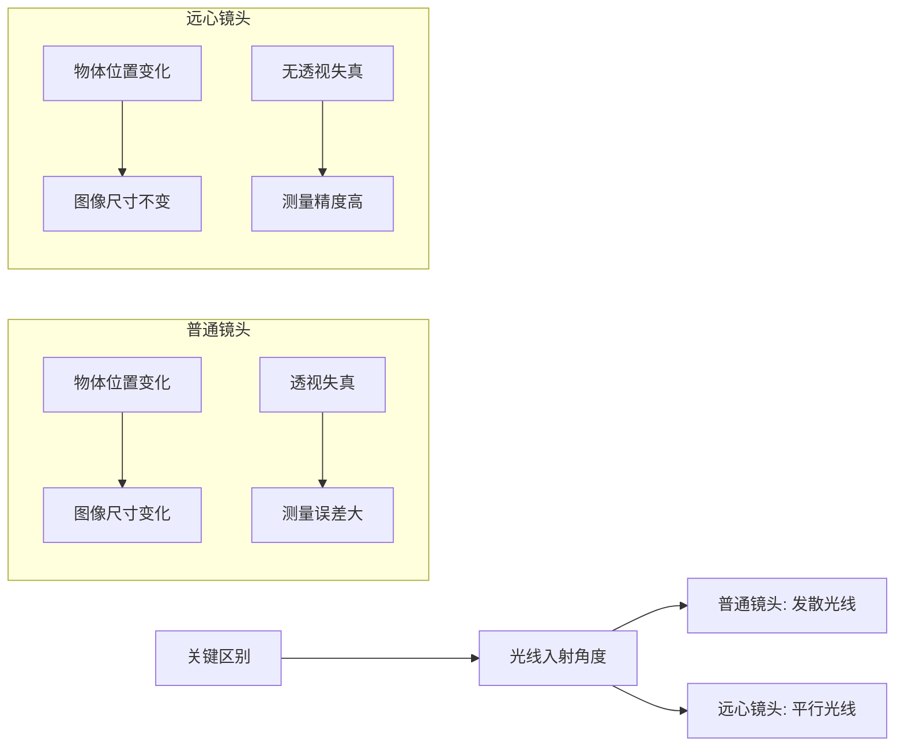

**【核心优势】**
远心镜头相比普通镜头的主要优势体现在四个方面：首先是**消除透视误差**，确保尺寸测量的准确性，特别适合微米级精度的工业检测；其次是**恒定放大倍率**，在景深范围内物体在图像中的尺寸不会随物距变化而改变；第三是**极低的图像畸变**（通常小于0.1%），远低于普通镜头的1-3%；最后是**较大的景深**，能够同时清晰成像不同高度的物体特征。

**【必须使用场景】**
远心镜头在以下场景中是必须使用的：**半导体制造**中的芯片、晶圆尺寸测量和缺陷检测，需要微米级精度；**精密机械加工**领域的零件尺寸检测和形位公差测量；**医疗设备制造**中的手术器械、植入物尺寸验证；**电子制造业**的PCB板元件位置、焊点质量检测；以及**光学元件检测**、薄膜厚度测量、材料表面缺陷检测等高精度应用。

**【技术要点】**
远心镜头的性能受多个技术参数影响：**工作距离**需要精确设定，**景深范围**要确保被测物体在有效范围内，**放大倍率**通常是固定的且需要根据应用选择，**数值孔径（NA）** 决定分辨率和集光能力，**分辨率**需要与相机传感器匹配，**照明方式**通常需要配合同轴光源或平行背光。

**【选择指南】**
选择远心镜头时需要考虑测量精度要求、被测物体尺寸、工作距离限制、相机传感器参数、照明条件以及环境因素的综合平衡。对于高精度测量应用，双侧远心镜头提供最佳性能；对于一般检测应用，物方远心镜头通常足够；对于特殊投影需求，像方远心镜头是合适选择。

**【发展趋势】**
随着工业4.0和智能制造的发展，远心镜头正朝着更高分辨率、更大视场、更小体积、智能化集成等方向发展。新型远心镜头开始集成自动对焦、变倍调节、在线校准等功能，并与机器视觉算法深度集成，为工业自动化提供更强大的视觉解决方案。

---
### 10. C接口和CS接口镜头的区别是什么？接错了会怎样？

#### 10.1 C接口和CS接口的基本定义和起源是什么？
C接口和CS接口都是工业相机和监控摄像机领域常用的镜头接口标准。C接口（C-mount）起源于16mm电影摄影机时代，由美国电影电视工程师协会（SMPTE）标准化，其名称中的"C"代表"Cine"（电影）。CS接口（CS-mount）是C接口的改进版本，由日本工业标准（JIS）制定，专门为闭路电视（CCTV）和监控应用设计。这两种接口在机械结构上相似，都是使用1英寸32牙的螺纹连接，但关键区别在于法兰距（Flange Focal Distance）。

#### 10.2 法兰距（Flange Focal Distance）的具体数值差异是多少？
法兰距是指从镜头接口安装面到相机传感器成像平面的距离。这是C接口和CS接口最核心的区别：
- **C接口法兰距**：17.526mm（通常简化为17.5mm）
- **CS接口法兰距**：12.526mm（通常简化为12.5mm）

两者之间的差值正好是5mm。这个5mm的差异决定了镜头能否在相机上正确聚焦。

#### 10.3 为什么法兰距的差异如此重要？
法兰距的差异直接影响镜头的成像质量。当镜头安装在相机上时，镜头的后主平面到传感器平面的距离必须等于镜头的焦距（对于无限远对焦）。如果这个距离不正确，图像就会失焦。具体来说：
- C接口镜头设计时假设传感器在镜头接口后17.5mm处
- CS接口镜头设计时假设传感器在镜头接口后12.5mm处
- 如果安装错误，成像平面无法正确落在传感器上

**示意图：C接口与CS接口法兰距差异**
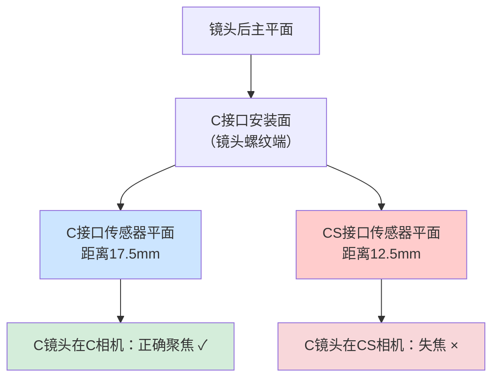

#### 10.4 C接口和CS接口的物理兼容性如何？
虽然C接口和CS接口的螺纹规格相同（都是1英寸32牙），但由于法兰距不同，它们不能直接互换使用。不过，可以通过转接环实现兼容：
- **CS接口相机使用C接口镜头**：需要添加一个5mm厚的C/CS转接环
- **C接口相机使用CS接口镜头**：理论上需要减少5mm距离，但实际中很少这样做，因为可能损坏传感器

#### 10.5 如果将C接口镜头直接安装到CS接口相机会发生什么？
如果错误地将C接口镜头直接安装到CS接口相机上（不加转接环），会出现以下问题：
1. **无法聚焦**：由于镜头后主平面距离传感器太远（多了5mm），图像完全失焦，无法获得清晰图像
2. **可能损坏传感器**：在某些情况下，镜头后部可能过于靠近或直接接触传感器表面，造成物理损坏
3. **IR-CUT卡住**：在一些摄像机中，红外截止滤镜切换机构可能被卡住无法正常工作

#### 10.6 如果将CS接口镜头安装到C接口相机会发生什么？
如果错误地将CS接口镜头安装到C接口相机上：
1. **无法聚焦**：镜头后主平面距离传感器太近（少了5mm），同样无法获得清晰图像
2. **图像扭曲**：可能产生几何失真或图像质量下降
3. **机械干涉**：在某些设计中，镜头可能无法完全安装到位

#### 10.7 如何正确判断和选择接口类型？
在实际应用中，可以通过以下方法判断：
1. **测量法兰距**：使用卡尺测量从相机接口面到传感器表面的距离
2. **检查标记**：许多镜头和相机在接口处会有"C"或"CS"标记
3. **观察螺纹**：虽然螺纹相同，但CS接口通常有更紧凑的设计
4. **参考说明书**：查看设备的技术规格

#### 10.8 转接环的工作原理是什么？
C/CS转接环是一个厚度为5mm的金属环，其作用是在CS接口相机上使用C接口镜头时，增加镜头到传感器的距离。当转接环安装在CS接口相机上后：
- 原本12.5mm的CS接口法兰距 + 5mm转接环 = 17.5mm
- 这正好符合C接口镜头的设计要求
- 转接环内部通常有螺纹，一端连接相机，另一端连接镜头

#### 10.9 在实际应用中，哪些领域主要使用哪种接口？
- **C接口**：广泛应用于机器视觉、工业检测、科学研究、医疗成像等领域
- **CS接口**：主要用于监控摄像机、安防系统、闭路电视等应用
这种分布主要是因为CS接口更紧凑，适合监控摄像机的小型化设计。

#### 10.10 现代发展趋势如何？
随着技术的发展，一些新的接口标准正在出现，但C接口和CS接口仍然是工业视觉和监控领域的主流。许多现代相机支持两种接口，通过可拆卸的接口环或适配器实现兼容。一些高端工业相机开始采用更先进的接口如F接口、M42接口等，但C/CS接口因其标准化和广泛兼容性，仍占据重要地位。

**总结回答：**

C接口和CS接口是工业相机和监控摄像机中两种常见的镜头接口标准，它们的主要区别在于**法兰距**（镜头接口面到传感器成像平面的距离）。C接口的法兰距为17.5mm，而CS接口为12.5mm，两者相差5mm。这个差异决定了镜头能否在相机上正确聚焦。

**关键区别对比：**
| 特性 | C接口 | CS接口 |
|------|-------|--------|
| 法兰距 | 17.5mm | 12.5mm |
| 螺纹规格 | 1英寸32牙 | 1英寸32牙 |
| 起源 | 电影摄影机 | 监控摄像机 |
| 主要应用 | 机器视觉、工业检测 | 安防监控、CCTV |

**接错接口的后果：**
1. **C接口镜头直接安装到CS接口相机**：
   - 图像完全失焦，无法获得清晰画面
   - 可能损坏相机传感器（镜头后部可能接触传感器）
   - 可能卡住红外截止滤镜切换机构

2. **CS接口镜头安装到C接口相机**：
   - 同样无法聚焦，图像模糊
   - 可能产生图像扭曲和几何失真
   - 镜头可能无法完全安装到位

**正确使用方法：**
- CS接口相机使用C接口镜头时，必须添加5mm厚的C/CS转接环
- C接口相机通常不能直接使用CS接口镜头
- 在购买和安装前，务必确认相机和镜头的接口类型

在实际应用中，这种接口错误是常见的安装问题，特别是在监控系统维护和工业视觉系统搭建时。正确的接口匹配对于获得高质量图像和避免设备损坏至关重要。

---

